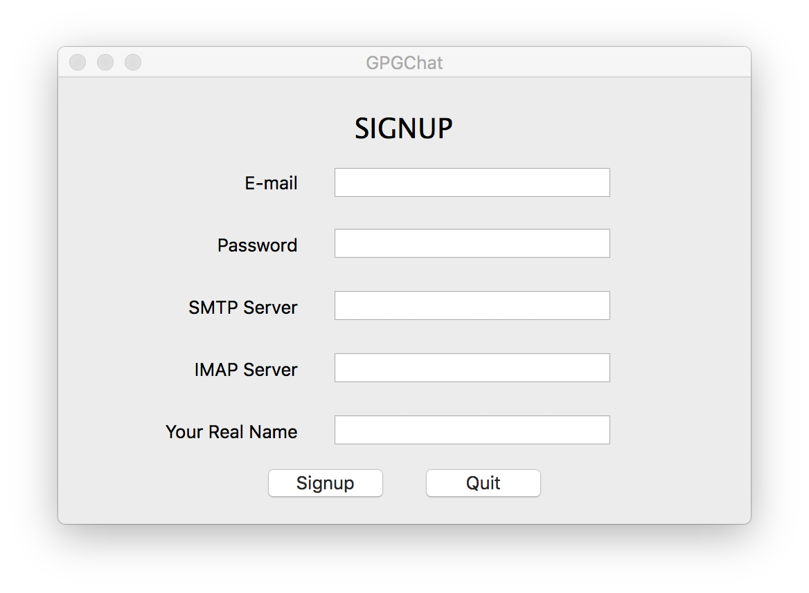
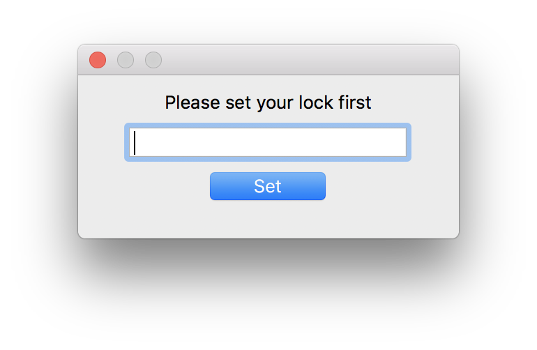
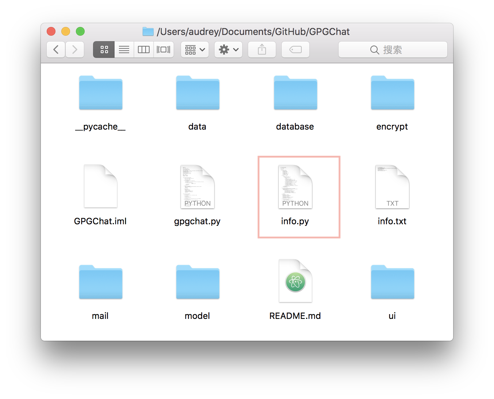
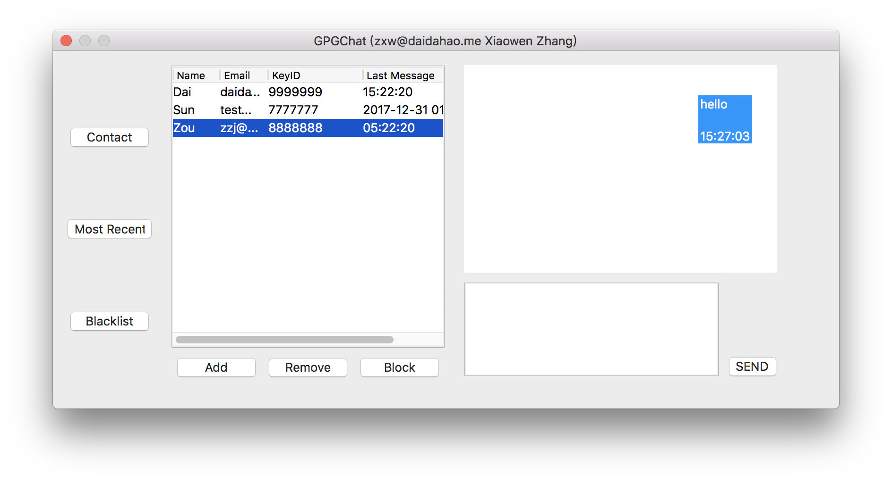

# GPGChat

GPGChat is an E-mail and GPG based Secured Instant Message Application. It implements a desktop IM application via IMAP using the existing email services.

In GPGChat, we do our best to ensure the safety of your instant communication.

Concretely, your email password as well as your message records in the local database will be safely stored `PBKDF2` as key derivation function and `AES` in `CBC` mode with a 128-bit key for encryption.

As our name imply, all your messages sent to and from you will be encrypted in the GPG fashion.

## Features

- Creates a pair of GPG keys and upload the public key to the public GPG server under the user's name for encrypting instant communication.
- Provides GUI for instant messaging.
- Provides contacts system based on GPG.
  - Add contact
  - Delete contact
  - Block contact
- Instant text messaging secured by GPG.
- Offers IM protocol in `HTTP` and `UUID` fashion.
- Local database for storing messaging records and contacts.
- Local storage of user's information and encryption of email's password using `PBKDF2` and `AES-128`.

## Getting Started

These instructions will guide you through setting up the necessary environments for GPGChat.

### Prerequisites

Since GPGChat is based on GnuPG and Python 3, you need to install the latest versions of them correctly following the instructions on [GnuPG Download](https://www.gnupg.org/download/index.html) and [Python.org](https://www.python.org). The installing steps may vary across different platforms.

Also, make sure you have installed `wxPython` , `cryptography` and `python-gnupg` before running.

If not, install the missing packages by the following commands.

```
pip install -U wxPython
pip install cryptography python-gnupg
```

### Setting up the GPG environment

To set up the GPG environment for GPGChat, you may need to modify the `gpgchat.py`.

Since the GPG environment vary across different platforms, you need to set `gpgbinary='gpg2'` on MacOS while on others (such as Windows) set `gpgbinary='gpg'`.

If both of these settings don't work for your system, please start a pull request.

### Running GPGChat

* In you command line, change your directory to this project and run the following commands.

```
python gpgchat.py
```

* If you are new to GPGChat, you will be asked to complete the sign up step. The password here is used to connect to your mail server.



* Then set a lock which is used to sign in this application. Once complated, a pair of GPG keys under your name will be generated and the public key will be uploaded to the server.



**Note:** All your personal information is now stored in a file, named `info.txt`, where your email password will be safely encrypted.



* After inistailizing the signup and application lock, you will be prompted to enter your password again and unlock the application.

> Notice that, once your email and lock are set, you cannot change it unless you remove `info.txt` from the program's directory, but you may lose all your records in this application.

* Congratulations! You are officially in the GPGChat world now.
* There are 3 buttons on the left: `Contact`, `Most Recent` and `Blacklist`, which correspond to displaying contact list in alphabetical order, in most recent contact order and displaying the blacklist.
* On the bottom, there are 3 buttons offering adding, deleting and blocking operations to manage the list.



* Again, all your communication will be encrypted using GPG during transmission.

* On exit, the local database (in the `data` directory) is encrypted. On the next time you sign in, it will be decrypted.

## Configuration

If you want to modify some parameters in GPGChat, here is a list of parameters you can modify in the head of `gpgchat.py`.

```
# Local database directory
dbdir = "data/"
# GPG data directory
gpgdir = "data/gnupg"
# GPG binary
gpgbinary = "gpg2"
# Local database file extension
dbext = ".db.sqlite"
# The user information file
infopath = "info.txt"
# Wating time for receiving email thread
waiting_time = 5
# Verbose option of GPG
# You may find it quite useful, when your GPG
# doesn't work correctly
gpgverbose = False
```

## Implementation

The GPGChat can be divided into 5 modules:`ui`, `mail`, `encrypt`, `database` and `util`.

### `ui`

In this module, we use `wxPython`, a cross-platform GUI toolkit for the Python language.

- `ui.py` is the skeleton file for UI and is generated by `wxFormBuilder` automatically.
- `starter.py` derives all the UI classes (including frames and dialog) from `ui.py` and provides the basic interactions for UI.

### `mail`

In this module, `smtplib` and `imaplib` are heavily used.

- `mail.py`
Mail services. Messages are pushed by SMTP protocol and pulled by IMAP protocol. It also offers mail information checking and message parsing functions.

### `encrypt`

`gnupg` and `cryptography` is imported.

- `fernet.py`
Symmetry cipher. It is used to encrypt local data, such as the mail password. String and byte encryption and decryption services are offered.

- `gpg.py`
Unsymmetry cipher. It is used to encrypt message content during transmission. It generates a key from an encrypted string which is processed by hash algorithm 10000 times to guarantee the security. Both encryption and decryption services are offered.

### `database`

`sqlite3` is imported.

> The local database is encrypted and stored in the `data` directory. It will only be decrypted in runtime.

- `init_db.py`
Create or connect a local database. Initialize it by creating 2 tables, `contact` and `message`.

- `db.py`
Database services. It offers adding, deleting, altering and searching operations on `contact` and `message` tables.

### `util`

This module provides `rm_file` and `write_file` functions for removing and writing bytes data to files.

In the main directory, `info.py` for encapsulation of user information and `gpgchat.py` for wrapping everything together are located.

## More Details
More details are offered in the `report` file.

## Authors

* **Zhihao Dai** - *UI & Merge* - [daidahao](https://github.com/daidahao)
* **Changchao Sun** - *GPG & IM Protocol* - [sunc2](https://github.com/sunc2)
* **Xiaowen Zhang** - *Mail & Database* - [11510746](https://github.com/11510746)
* **Zijing Zou** - *UI & Fernet* - [zouzj](emm...)
